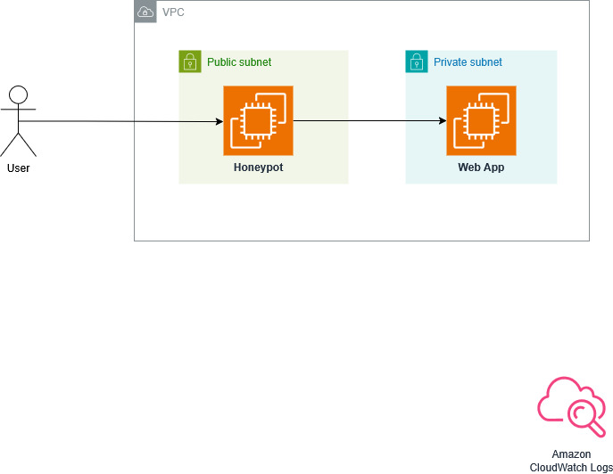

Honeypot README
===============

.. contents:: :local:

Note
----
This repository is currently work in progress.

Background
----------
This honeypot is to monitor what kind of exploitations a web application experiences and gather threat intelligence.

Usage
-----
Make sure that this honeypot is set to be a reverse proxy in front of the real web application. 

Architecture
------------

Installation
------------
.. code-block::

    pip install -e.[dev]